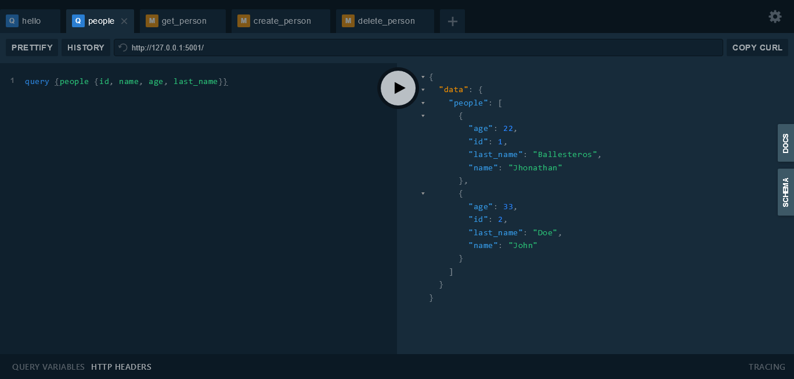

# GraphQL API using Ariadne framework

[Ariadne](https://ariadnegraphql.org/) provides a very clean approach to link your GraphQL schema with Python. This implementation integrates it with Flask and SQLAlchemy as a real world application, and exposes a visual sandbox to play with.

## Getting Started

### Installing and running

Clone the repository using HTPPS or SSH:

```bash
# SSH
git clone git@github.com:Trowsing/ariadne-crud-api.git

# HTTPS
git clone https://github.com/Trowsing/ariadne-crud-api.git
```

Install all dependencies using [pipenv](https://pipenv.kennethreitz.org/en/latest/#install-pipenv-today) and log into its shell:

```bash
pipenv install
pipenv shell
```

Run the application locally:
```bash
python graphql-api/handler.py
```

## Schema and Sandbox

The main application endpoint is `/graphql`
 


It will show the sandbox and receive your queries and mutations.

## Queries

---

`query {hello}` 

Returns a hello message with your browser's *UserAgent* property.

---

`query {people {<field-parameters>}}`

Returns a list of all users in the database.
 
Here you can provide `id`, `name`, `last_name` or `age` as field parameters separated by commas.

Example: `query {people {age, name}}`

---


## Mutations

---

`mutation {get_person (id: 1) {<field-parameters>}}`

Returns a user matching the provided ID.

`id`, `name`, `last_name` and `age` can be used as field parameters.

---

`mutation {create_person (name:"John", last_name:"Doe", age:33) {<field-parameters>}}`

Creates a user and returns the queried fields.

`name`, `last_name` and `age` must be passed as data to create the user.

`id`, `name`, `last_name` and `age` can be used as field parameters.

---

`mutation {delete_person (id: 3) {<field-parameters>}}`

Deletes a user matching the provided ID and returns its data if the operation was successful.

If there are not users matching the query, a `null` value will be returned instead.

`id`, `name`, `last_name` and `age` can be used as field parameters.

---